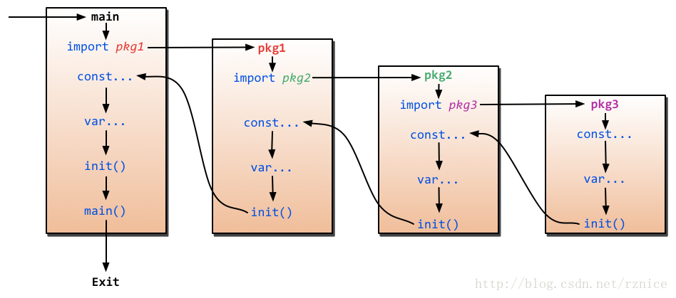

## go-init
go 语言提供了包(package)管理机制来管理源码。 </br>
相比较于c和c++使用header和source文件分离的方式来管理代码， package的管理方式是一个十分大的进步。</br>

go 语言中的包使用简单方便, 如果你需要使用某个包的变量，函数等， 你仅仅需要使用import packageName。</br>
刚开始使用go语言的同学可能不清楚， go 对于package管理提供了init函数， 方便package初始化资源。</br>

### init 函数基本用法
下面将简单介绍init函数的基本情况：


在单个package 中是可以定义多个init函数。</br>

```go
package in

import (
	"fmt"
)

func init() {
	fmt.Println("run init function")
}

func init() {
	fmt.Println("run init function 1")
}

func init() {
	fmt.Println("run init function 2")
}

func T() {
	fmt.Println("run function t")
}

```

在main函数中调用T函数， 我们可以看到运行效果：
```
run init function
run init function 1
run init function 2
run function t
```
**通过上面运行的结果， 可以很清楚的看到，init函数可以被定义多个， 多个init函数运行的顺序应该是先被编译器发现的先执行(猜测), init函数是在main函数之前执行的。**

### 总结
* init 函数在main函数之前执行， 用以初始化包的变量等
* 单个package 中定义多个init函数
* 同一个包中多个init函数执行的顺序不确定
* 不同包的init函数按照包导入的依赖关系决定该初始化函数的执行顺序
* init 函数不能被其他函数调用
* init 函数不能传参和有返回值

