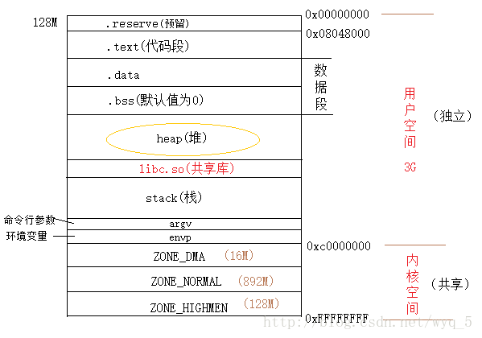

## malloc 函数

当我们刚刚学习c语言的时候，老师都会教我们， 如果需要向系统申请内存， 我们就使用malloc函数， 当内存使用结束之后，应该使用free函数释放内存， 如果忘记释放，就会造成内存泄露。

c开发者对于malloc和free函数应该都非常的熟悉， 但初学者可能并不清楚malloc和free函数背后的设计思路。

Linux下我们查看man帮助手册($man malloc)，可以看到malloc和free函数说明：

```c
#include <stdlib.h>
       
void *malloc(size_t size);
void free(void *ptr);
```

上面2个函数非常简单，易学易用，函数的用法不是今天介绍的重点， 今天主要是思考它的实现原理。

我们先思考下malloc函数的基本要求(如果我们自己实现这2个函数， 我们应该做到怎样)：

1. 可以实现向系统申请一段可用的内存，内存的最小值为size

2. malloc返回一个指针， 且指针指向的位置为可用内存的起始位置

3. malloc必须是线程安全，也就说任意情况下申请的内存不能重叠

4. malloc申请的内存必须能够通过free函数释放


   如果我们仅仅只是懂c语言，我们会发现不依赖更底层的接口(操作系统的API)， 我们压根没法实现上述2个接口。在这突然想起一句话，“计算机科学领域的任何问题都可以通过增加一个间接的中间层来解决”。

   为了实现malloc和free函数， 我们必须了解一些操作系统层的知识。

   下面我们将以linux为例简单介绍一些linux系统的基础知识

   在介绍之前给大家推荐一本书《LINXU/UNIX系统编程手册》, 书分上下2册，如果你想学习一些linux或unix操作系统的知识，那么这边书值得我们反复阅读。

   ## 虚拟地址

     linux的内存管理异常的复杂，并非简单几篇文件可以讲述清楚，我们首先讲几个基本的概念，方便大家以后深入学习。

   首先我们需要了解虚拟地址这个概念。

   #### 什么是虚拟地址？

   虚拟地址是指**由程序产生的**由段选择和段内偏移地址两部分组成的地址。

   （因为这两部分组成的地址并没有直接用来访问物理内存，而是需要通过分段地址变换机制或映射后才对应到物理内存地址上，故被称为虚拟地址。）

   #### 为什么需要使用虚拟地址？

   回答这个问题之前， 我们需要知道一些简单的linux系统知识。首先linux系统分为kernel和其他2部分。光看名字我们就知道kernel是整个系统的核心(主要作用：存储管理、CPU和[进程管理](https://baike.baidu.com/item/%E8%BF%9B%E7%A8%8B%E7%AE%A1%E7%90%86)、文件系统、设备管理和驱动、网络通信，以及系统的初始化、系统调用等）。大家想想，如果没有kernel， 我们的系统直接跑在硬件之上， 会发生什么情况？？？ 第一：2g内存大小的电脑，同一时刻可能只能跑一个需要2g内存的程序。 第二：多个程序的时候，可以相互之间查看或修内存数据。 第三：有一个程序崩溃，其他程序跟着一起崩溃。 第四。。。。。

   正是为了解决上述问题， 前人开发出kernel这个软件。

   为了让更多的程序在同一时间运行， 且大家不会互相干扰，前人就搞了虚拟地址这个概念。

   #### 虚拟内存布局   

   

   .reserve(预留)段
   一共占用128M，属于预留空间，进程是禁止访问的

   .text(代码段)
   可执行文件加载到内存中的只有数据和指令之分，而指令被存放在.text段中，一般是共享的，编译时确定,只读，不允许修改

   .data
   存放在编译阶段(而非运行时)就能确定的数据,可读可写。也就是通常所说的静态存储区,赋了初值的全局变量和赋初值的静态变量存放在这个区域,常量也存放在这个区域

   .bss段
   通常用来存放程序中未初始化以及初始化为0的全局/静态变量的一块内存区域，在程序载入时由内核清0

   .heap(堆)
   用于存放进程运行时动态分配的内存，可动态扩张或缩减，这块内存由程序员自己管理，通过malloc/new可以申请内存，free/delete用来释放内存，heap的地址从低向高扩展，是不连续的空间

   .stack(栈)

   记录函数调用过程相关的维护性信息，栈的地址从高地址向低地址扩展，是连续的内存区域

   这里简单总结：**我们平时写的程序在运行的时候会生成一个程序镜像。镜像的主要布局就是上面看到的内存布局，平时我们使用printf打印变量的地址就是虚拟的地址。 我们的程序看上去是拥有4G空间， 但真实的使用物理内存就远远小于4G。且内存比较吃紧的时候，内存可能会被swap到磁盘上**。

   说完虚拟地址， 我们需要看下linux给我们提供了怎么样的API。

   ### 系统API

   linux 系统调用相比较于其他系统非常的精简，记得好像在那本书上看过，常用的也可能就300个左右。

调整program break：brk() 和 sbrk()

进程可以通过增加堆的大小来分配内存，所谓的堆从上面的图就可以看出堆就是一段长度可变的连续虚拟内存，开始于进程的未初始化数据段的末端，随着内存的分配和释放而增减。而program break指的就是当前内存边界。

```c
#include <unistd.h>
int brk(void *addr);
void *sbrk(intptr_t increment)
```
这2个函数其实最早是unix提供的， 在linux上依旧可以使用。

brk函数是将program break设置为addr 所指定的位置。

通过这个api，我可可以清楚的了解到， 如何向系统申请堆空间。

如果我们开发app直接使用brk这个函数， 很快，我们就会意识到，在app中管理内存非常的麻烦。

当我们申请了多块内存时，我们很快就会发现， 如果我们想要释放它， 通过设置program break点太困难了。

这个时候， 正常人想到的办法肯定是写一个用户空间的内存管理， 我们先向系统申请一段内存， 当我们不再使用内存时， 我们并不需要即刻返回给操作系统， 我们可以先把它管理起来，在程序运行的其他时刻复用它。

### 简单模拟malloc函数


```c
#include <sys/types.h>
#include <unistd.h>
void *malloc(size_t size)
{
    void *p;
    p = sbrk(0);
    if (sbrk(size) == (void *)-1)
        return NULL;
    return p;
}

```


上面的模拟非常的简单，且malloc函数无法多次调用，仅仅是用来说明问题。


### 总结

在linux系统，系统提供brk函数来向系统申请堆内存。平时我们使用的malloc就是居于brk函数实现。

本质上内存的申请就是通过设置program break来实现。

malloc函数居于rbk封装了一层内存管理。