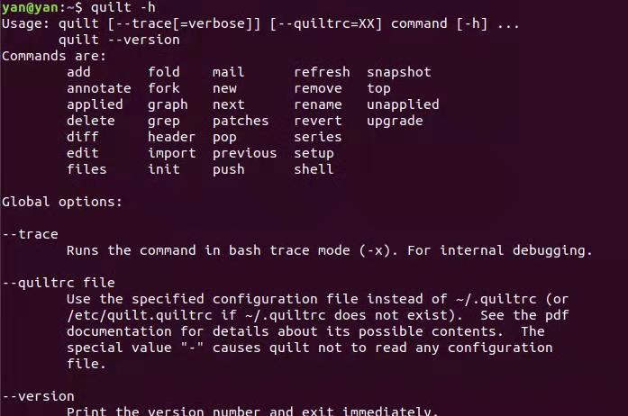

**Linux下quilt补丁管理工具**

今天修改linux下chntpw包的bug，发现ubuntu下这个包是采用quilt工具来管理patch的，好久没有使用这个工具，突然间不记得之前的使用方法了，今天记录下来，以便以后复习或查询使用。

quilt可以帮助我们管理patch，主要包含创建patch， 应用patch， 撤销patch，导入patch。

创建的patch会存放在patches目录里面，里面还会包含一个series文件，这个文件记录了patches的顺序。

.pc目录下记录了quilt工具的自身的状态，我们不用关心。


下面以ubuntu系统为例说明quilt工具的使用方式：

1. 安装quilt包

   `sudo apt-get install quilt`
   
2. 设置环境变量

   `export QUILT_PATCHES=/home/debpackage/patches`

   通过上面的命令来设置patches的路径。

   如果不设置上面的环境变量，quilt会默认当前路径为patches的上级目录。


3. quilt 支持的命令

   

   

4.如何创建一个完整的patch

```shell
quilt new 01_fix_seafault_bug.patch    // 创建新的patch,生成空的文件

quilt add  file                       //关联文件

quilt edit file                       //修改文件

quilt refresh file                    //将关联文件的修改写入到

```


5.管理patch， patch应用到源码上

```shell
quilt push patch_name  //应用patch
quilt push  -a         //应用所以patch
```


6.撤销patch

```shell
quilt pop  patch_name  //撤销某个patch

quilt pop -a           //撤销所以应用的patch
```


7.取消对文件patch的关联

```shell
quilt remove file_name
```


8.查看修改文件的修改

```shell
quilt diff  
```


9.查看当前patch关联的文件

```shell
quilt files
```


10.查看所有的patch

```shell
quilt series  //其实就是patches目录下series里面的内容
```


11.查看当前已经应用的patches

```shell
quilt applied
```


12.查看当前未应用的patches

```shell
quilt unapplied
```


**剩下的用法小伙伴自行研究吧！**